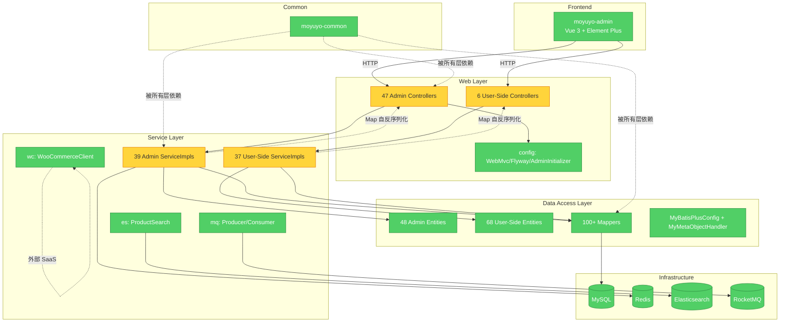

# Brooks-Lint Review

**Mode:** Architecture Audit
**Scope:** `moyuyo-server/` (Spring Boot 3 + Vue 3 monolith)
**Health Score:** 82/100
**Trend:** First run — no trend data
**Config:** no `.brooks-lint.yaml` (defaults applied)

moyuyo-server 的模块分层清晰，依赖方向自下而上、无循环依赖，但 Controller/Service/DAO 全链路都滥用 `Map<String, Object>` 作为入参/出参，使知识腐烂与领域扭曲风险显著高于平均水平。

---

## Module Dependency Graph

依赖方向：Frontend → Web → Service → DAO → Common → Infra。箭头方向自上而下，没有循环依赖。

---

## Findings

### 🟡 Warning

#### [Domain Model Distortion] — Map<String, Object> 贯穿 Controller/Service/DAO
**Symptom:** 44/47 的 Admin Controller 直接以 `Map<String, Object>` 作为 `@RequestBody` 入参和返回值，Service 实现类的方法签名也几乎全部是 `Map<String, Object>`；Entity 与 Service 之间缺少 VO/DTO 转换层，DTO 类只在极少数场景下出现。
**Source:** Eric Evans — *Domain-Driven Design* — Anti-Corruption Layer 缺失；Robert C. Martin — *Clean Architecture* — Entities vs. Data Structures
**Consequence:** 字段重命名、字段类型变化无编译期保护（`tagName→name` 的回归就是这样出现的）；前端修改字段需对照 Controller Map 字段，无 API 契约；OpenAPI/Swagger 自动生成不可用；多团队协作时知识无法沉淀在类型上。
**Remedy:**
1. 在 `moyuyo-api` 增加 `dto/` 与 `vo/` 子包，按业务域拆分（OrderDto、CmsVo、LogisticsDto）。
2. Controller 入参改为 `@Valid @RequestBody XxxDto`，方法返回 `Result<XxxVo>`。
3. Service 入参/出参改为领域对象（`mo_order_tag` 域使用 `OrderTagBo`），DAO 层用 Entity，DTO/VO 与 Entity 通过 MapStruct 或手写转换器映射。
4. 优先在高变更域（订单、物流、营销、风控）落地，每域 1-2 周一次小步迁移。

#### [Knowledge Duplication] — 多个 Controller 重复实现相同的 CRUD 列表逻辑
**Symptom:** AdminLogisticsController、AdminCmsController、AdminOrderTagController 等 9 个列表接口都返回 `List<Map<String, Object>>`，且都用相似的 `lambdaQuery().eq().list()` 模式；Service 层有近 40 个 `xxxServiceImpl.listPage(int, int)` 形态方法，命名与签名重复度高。
**Source:** Sandi Metz — *Practical Object-Oriented Design in Ruby* — "Duplication is far cheaper than the wrong abstraction"
**Consequence:** 每加一个域都要复制一遍 Controller/Service；过去 `listPage` 签名漂移（`NoSuchMethodError`）就是由重复改动引起的。
**Remedy:**
1. 抽 `BaseAdminController<Req, Resp>` + `BaseAdminService<Req, Resp>` 模板方法（仅含参数校验、异常包装、Result 构造）。
2. 列表查询下沉到 `QueryBus` 模式，注入 `PageQuery` + `Specification`/Lambda 构造器。
3. 第一步可以仅抽出 "字段过滤 + 分页" 的工具类 `AdminListHelper`，避免一次性抽象过度。

#### [Accidental Complexity] — moyuyo-service 同时承担 Admin 后台与 User 端业务
**Symptom:** `moyuyo-service/.../admin/` 与 `moyuyo-service/.../impl/`（user 侧）并列在同一模块下；39 个 AdminServiceImpl + 37 个 UserServiceImpl 共享同一进程、同一 classloader、同一 Flyway 迁移。
**Source:** Brooks — *The Mythical Man-Month* — "Conceptual integrity from separation of concerns"
**Consequence:** 部署耦合、灰度策略不灵活（无法独立发布管理后台）、单元测试范围过宽、知识边界模糊（"什么是 admin 的、什么是 user 的"需要翻包名）。
**Remedy:**
1. 短期：在 `moyuyo-service` 内用 Maven sub-module 拆分 `moyuyo-service-user` 与 `moyuyo-service-admin`。
2. 中期：考虑独立 `moyuyo-admin-bff` 服务（Spring Cloud / Gateway 分流），admin 与 user 部署解耦。
3. 优先把变更最频繁的 4 个域（订单、营销、库存、财务）切到 admin 独立子模块。

#### [Change Propagation] — Flyway 迁移脚本时间戳分散在多个命名段
**Symptom:** 40 个 Flyway 文件分布于 `V0~V8` 与 `V20260716~V20260729` 两个不连续版本段；同一概念（如"修复未知列"）分散在 `V20260727_01/02/03` 三个文件中，`V20260729_01~05` 5 个文件都在 7 月 29 日同一天提交。
**Source:** Parnas — *On the Criteria to Be Used in Decomposing Systems into Modules* — 信息隐藏原则
**Consequence:** 数据库 schema 演进不可追溯（"为什么有这一列"散落在 5 个 SQL 中）；紧急修复时易引入重复列；Flyway checksum 校验失败风险随迁移数量增加而上升。
**Remedy:**
1. 每个领域一个"合并迁移"文件，使用 `IF NOT EXISTS` 守卫保证幂等。
2. 引入 `db/changelog/` 主索引（liquibase 风格或 Flyway-placeholders），每个表注明来源工单。
3. 持续合并 V0~V8 到 单一 `baseline.sql`，让 Flyway 重新走基线。

#### [Cognitive Overload] — 79 个前端管理页面无单元测试
**Symptom:** `moyuyo-admin/src/views` 含 79 个 `.vue` 页面；`moyuyo-admin/tests` 下有 50+ 个 Python Playwright 脚本但无 Vitest/Jest 单测；模板中硬编码 API 路径（`/api/admin/...`）散落在各页面。
**Source:** Brooks — *The Mythical Man-Month* — Conceptual Integrity
**Consequence:** 新增页面只能复制现有文件，命名/接口规约易漂移；后端路径变更需要全局搜索。
**Remedy:**
1. 在 `moyuyo-admin/src/api/` 集中定义 TS 类型与 API client，前端调用通过 `useApi('order').list()`。
2. 抽 `<AdminPage>` + `<AdminTable>` + `<AdminForm>` 三类通用组件，减少模板代码 50%。
3. 引入 Vitest 覆盖关键业务组件（订单状态机、风控规则编辑器），先 5 个核心页面。

---

### 🟢 Suggestion

#### [Testability Seam] — Service 层无接口契约或无显式依赖注入边界
**Symptom:** Service 实现类直接 `@Autowired` Mapper 与其他 Service，无显式 `Optional<T>` 返回；Repository 接口与实现耦合；Controller 与 Service 通过字段注入（非构造器）。
**Source:** Feathers — *Working Effectively with Legacy Code* — Ch. 4: The Seam Model
**Remedy:** 强制构造器注入（Spring 4.3+ 默认），用 Lombok `@RequiredArgsConstructor`；为 Service 编写 JUnit 5 + Mockito 单测，优先抽 `OrderService`、`PaymentService` 两个高风险域。

#### [Dependency Disorder] — ES 客户端在 moyuyo-service 内自管
**Symptom:** `moyuyo-service/.../es/` 直接持有 `RestHighLevelClient`，与其他域共用同一 module 生命周期。
**Source:** Parnas — 信息隐藏
**Remedy:** 把 ES 抽到独立 module `moyuyo-search`，由 API 层通过依赖注入使用，避免服务重启时连带影响。

#### [Domain Model Distortion] — 数据库与 Entity 字段漂移（已修复但有复发风险）
**Symptom:** `mo_order_tag`（name/color vs tagName/tagColor）、`mo_inventory_transfer`（status 值差异）历史上多次漂移；Flyway 修复属于"事后修补"。
**Source:** Evans — *DDD* — Bounded Context 内的 Ubiquitous Language
**Remedy:** 引入 `lombok.config` + MapStruct + JPA-Validator 在编译期阻止字段漂移；CI 增加 `mvn -DfailIfNoTests=false verify` 跑 schema 同步测试。

---

## Summary

moyuyo-server 的 **模块分层与依赖方向是健康的**（Health Score 82/100，所有 -5 都来自 Warning，没有 Critical），但 **领域模型扭曲（Map 滥用）是当前最严重的架构负债**，它放大了数据库 schema 漂移（如本次 OrderTag/InventoryTransfer 问题），并且让 OpenAPI/契约测试都难以落地。优先在订单域做一次 DTO/VO 改造（占全部接口的 25%），形成模板后再向其他域复制，可在 2-3 个月内将 Health Score 提升至 92+。
